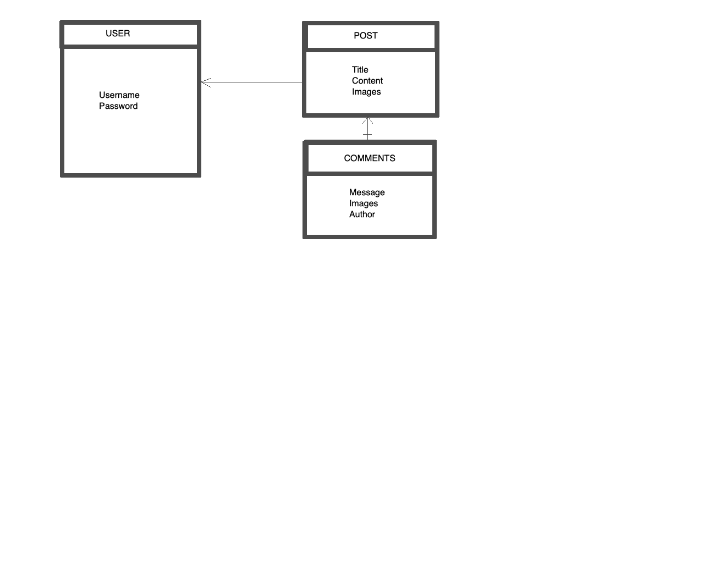

# Wander-Blog-Django

# Project 4 Django

## Overview

A GIRL, a JEEP, and a PASSION TO EXPLORE!

A blog to share Sydnei's love of exploring, while juggling being a full-time student. A way for her to communicate and meet other students that share the same passion.

!

Posts will have trail subject and posts can include images about various points on trail.

example - Mojave Trail Lava Cave

There will be a tips/maintenance/safety section... let's face it, girls have different obstacles then many boys when exploring

### Technologies Used

- Django
- React
- HTML5
- CSS
- Node
- Bootstrap

### Link

TBD

## Approach

## Installation Instructions

## User Stories

- As a unregistered user, I would like to sign up with email and password.
- As a registered user, I would like to sign in with email and password.
- As a signed in user, I would like to change password.
- As a signed in user, I would like to sign out.
- As a unregistered user, I would like to see all users blog posts.
- As a unregistered user, I would like to see comments on those blog posts.
- As a signed in user, I would to create blog posts.
- As a signed in user, I would to comment on other users' blog posts.
- As a signed in user, I would to update my blog posts and comments.
- As a signed in user, I would to delete my blog posts and comments.

## Wireframes

## ERD

Routes

URL	HTTP Verb	Actions
/auth/sign-up	POST	new
/auth/login	POST	create
/auth/logout	DELETE	destroy

URL	HTTP             |    Verb	        |     Actions
--------------------------------------------------

/auth/sign-up	     |    POST	        |     new
/auth/login	         |    POST	        |     create
/auth/logout	     |    DELETE	    |     destroy

/posts/	             |    GET	        |     index
/posts/mine	         |    GET	        |     index
/posts/              |    POST	        |     create
/posts/:id	         |    PATCH	        |     update
/posts/:id	         |    DELETE	    |     delete

/replies/	         |    GET	        |     index
/replies/:postId	 |    POST	        |     create
/replies/:postId/:replyId|	PATCH 	    |     update
/replies/:postId/:replyId|	DELETE	    |     delete

## Unsolved Problems / Major Hurdles
